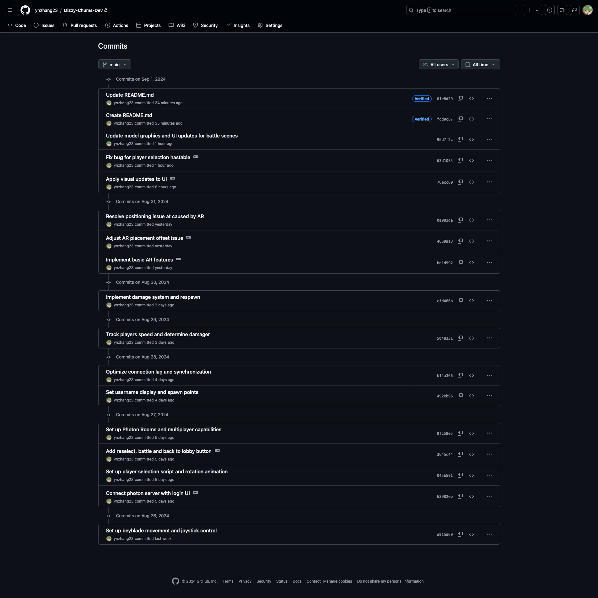
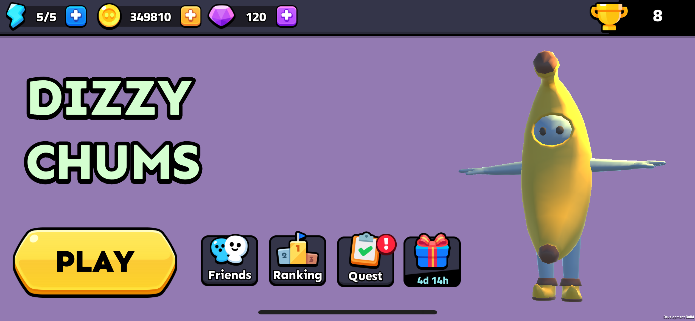
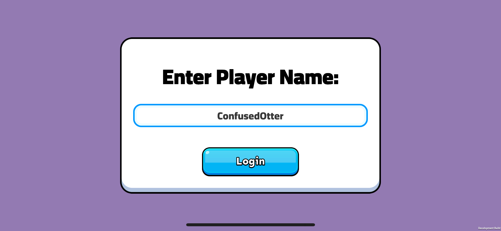
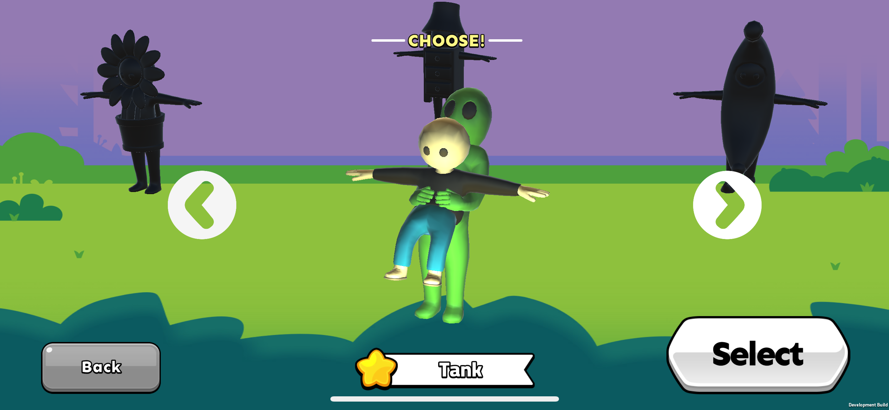

# Dizzy Chums

Dizzy Chums is a mobile AR online multiplayer game created using [Unity's](https://unity.com/) and its [ARFoundation](https://unity.com/unity/features/arfoundation) framework, blending both virtual and real-world environments. The game features real-time multi-user AR synchronization, allowing players to engage in dynamic, physics-driven combat across shared AR spaces.

Key technical achievements include:
- Real-time AR environment mapping and synchronization across multiple devices
- Dynamic physics-based gameplay using Unity's physics engine
- Cross-platform compatibility (iOS/Android) through ARFoundation
- Low-latency multiplayer interactions via [Photon PUN2](https://www.photonengine.com/pun) networking
- Server-side battle validation to ensure fair play and prevent cheating
- Adaptive AR recalibration system for consistent user experience across various real-world environments

## Technical Details
- **Engine**: Unity 2022.3.10f1
- **AR Framework**: ARFoundation, ARKit (iOS), ARCore (Android)
- **Networking**: Photon PUN2
- **Platform**: iOS, Android

## Commit Log
Development works are done on a private repo to protect the copyrighted Assets.

## In-Game Footage

The core of Dizzy Chums is its innovative AR battle system. Players can:
- Flat surface detection from ARFoundation enables player to place arena on any flat surfaces around them.
- Engage in real-time AR combat with physics-based interactions
- Interact with the battle field from different angles in real life
- Experience consistent gameplay across various lighting conditions and environments

### Realtime AR Sizing

The game arena can be manually adjusted in realtime to fit the available real-world space, ensuring optimal gameplay in various environments.

### Battle

#### 360 Battle
Players can move around the AR arena, viewing and interacting with the game from any angle, providing a truly immersive 360-degree experience.

#### Player 2 POV
A glimpse into the second player's perspective, showcasing the synchronized multiplayer AR experience.

#### Death Respawn
Player respawns scene.

### UI Interface
The user interface features smooth transitions and intuitive controls for character and game initiation.

### Login

### Character Selection

## Installation
1. Clone the repository
2. Open the project in Unity 2022.3.10f1 or later
3. Install required packages (listed in `Packages/manifest.json`)
4. Refer to 'Asset Credit' for more information on 3D characters and 2D UI
5. Build and run on a compatible AR device

## Asset Credits

This project uses the following assets from the Unity Asset Store:

1. [GUI Pro Super Casual PSD](https://assetstore.unity.com/packages/2d/gui/gui-pro-super-casual-psd-272918)
   - Used for user interface elements and design

2. [Funny Characters - Low Poly Asset Pack by iTHappy](https://assetstore.unity.com/packages/3d/characters/humanoids/funny-characters-low-poly-asset-pack-by-ithappy-242892)
   - Used for character models and animations